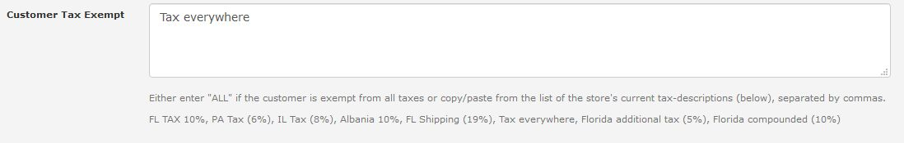

# Customer Tax Exempt &mdash; v2

This plugin is based on the [Customer Tax Exempt](https://www.zen-cart.com/downloads.php?do=file&id=405) plugin, with the exception that _this_ plugin supports **only** Zen Cart v1.5.6 and later and has no core-file modifications required.  Click [here](https://www.zen-cart.com/showthread.php?225841-Customer-Tax-Exempt) to view its support-thread on the Zen Cart forums.

## Description

If you have customers that have tax-exempt status, this _drop-in_ plugin enables your store's admins to identify the taxes (based on the associated _tax description_) from which the customer is exempt.

Once you have installed (or upgraded) the plugin, a new data-entry field &mdash; **Customer Tax Exempt** &mdash; is available when a store admin views a customer's details via the **Customers->Customers** tab:

1. If that field is empty, the customer has **no** exemptions.
2. If that field is set to **ALL**, the customer is exempt from _all_ taxes.
3. Otherwise, you identify _specific_ taxes from which the customer is exempt as a comma-separated list of tax-descriptions for your store.  The instructions below the field list the tax-descriptions currently defined for your store, making it easy to copy-and-paste the values.

When a customer has tax-exemptions, the plugin's storefront additions monitor requests for tax-related information, e.g. tax-rates and tax-descriptions, and override the "normal" values based on the customer's tax-exempt status.
